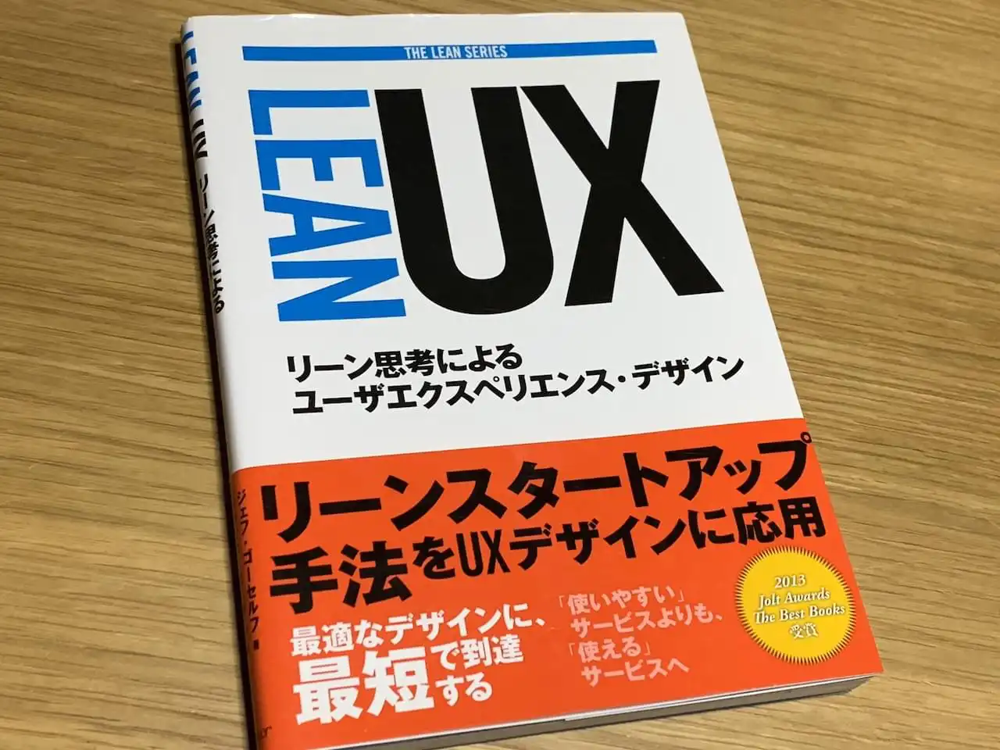

ジェフ・ゴーセルフ 著、 児島 修 翻訳、[Lean UX ―リーン思考によるユーザエクスペリエンス・デザイン 第1版](https://www.amazon.co.jp/Lean-UX-%E2%80%95%E3%83%AA%E3%83%BC%E3%83%B3%E6%80%9D%E8%80%83%E3%81%AB%E3%82%88%E3%82%8B%E3%83%A6%E3%83%BC%E3%82%B6%E3%82%A8%E3%82%AF%E3%82%B9%E3%83%9A%E3%83%AA%E3%82%A8%E3%83%B3%E3%82%B9%E3%83%BB%E3%83%87%E3%82%B6%E3%82%A4%E3%83%B3-LEAN-%E3%82%B8%E3%82%A7%E3%83%95%E3%83%BB%E3%82%B4%E3%83%BC%E3%82%BB%E3%83%AB%E3%83%95/dp/4873116619/ref=cm_cr_arp_d_product_top?ie=UTF8) を読んだ。

リーンという言葉は、アジャイル、スクラム開発、DevOpsなどと並んでモダンな開発フローに関係するバズワードの1つだろう。先日読んだ[起業の科学 スタートアップサイエンス](../book-review-startup-science-isbn978-4-8222-5975-4)でも「リーン的な」「リーンスタートアップ」と言う言葉がたくさん出てくる。リーン（lean）は英語で「無駄がない」とか「傾いている様子」と言う意味で、おそらく無駄を削ぎ落とした方法論というニュアンスが込められているのだろう。ちなみに進んでいるカヤックを重心移動で曲げる技術のことをリーンと言う。

本書はリーンスタートアップにおける特に UX の改善の手法についてフォーカスしたものだ。 _起業の科学_ では、"Content is king, UX is queen"という標語がしばしば登場し、PMF (Product Market Fit)を達成するために継続的な UX 改善がどれだけ重要かと言うことが語られている。

本書の中でトピックとして扱われていると感じたのは以下の3つ。

1. チームでのコラボレーションの技術
2. 課題に対するアプローチを検証可能な仮説として扱い、実際に検証する手と、MVP (Minimum Viable Product) の UX を継続的に改善していく具体的な手法
3. リーン思考によるプロジェクトマネジメント・組織論

## チームコラボレーション

プロジェクトへの共通理解をコアとした凝集度の高いチームをいかに作るかがリーン的な手法だと語られていると感じた。そのために必要なのはラフやプロトタイピング。これらの存在がプロジェクトの透明性を高めチーム間のコミュニケーションの敷居を下げる。アジャイル的な開発で文書の準備が必要無くなるのはなぜかといえば、メンバーの共通理解が前提としてあるからだ。なお、第一版は2014年の出版なので、流石に紹介されているプロトタイピングツールは古かった。

また、本書では適切にメンテナンスされたスタイルガイドの重要性について触れている点も印象に残った。チーム内でのコミュニケーションコストが下がるし、顧客との対話にも直接使える。スタイルガイドは、曖昧な境界を共有するUXデザインとUIデザインのタスクを橋渡しする重要なドキュメントになる。

## 検証手法

MVPのUXを検証する上でコアとなるのは一貫して顧客からのフィードバックである。本書では、多くのページを割いて、どのようなツールと手法を使いフィードバックループを最小のコストで回していくかが述べられているようだ。私にはひどく抽象的なように感じられあまり頭には入って来なかった。

## 組織論

メンバーの対話を重視するチームコラボレーションや検証において経験した短いサイクルで繰り返したループは、マネジメントや組織論にも適用される。トップダウン型の組織から網の目のように有機的に繋がった組織構造への変革を促している。組織に必要となるのは変化に追従するアジリティだ。
本書で語られている組織論は、この本より後の時代に出現する **ティール組織** という概念に発展していくと予想している。

---
この本は現在副題を変更した第2版が出ている。

[Lean UX 第2版 ―アジャイルなチームによるプロダクト開発](https://www.amazon.co.jp/Lean-UX-E7-AC-AC2-E7-89-88-E2-80-95-E3-82-A2-E3-82-B8-E3-83-A3-E3-82-A4-E3-83-AB-E3-81-AA-E3-83-8/dp/4873118050/ref=dp_ob_title_bk)

