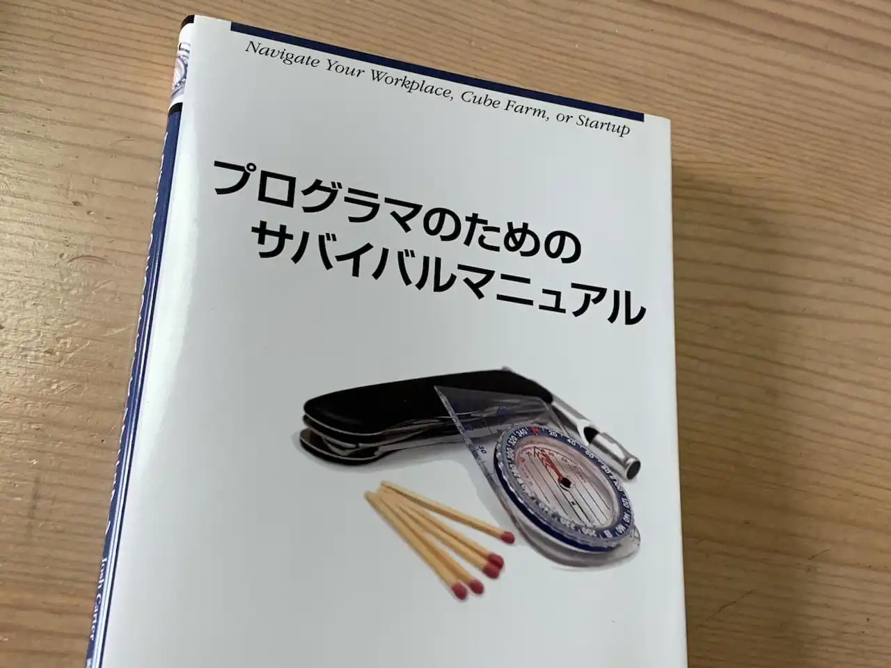

昔読んだ古い本が出てきたので内容をざっと見直してコメントを記録したい。

この本はプログラミングを職業にしたい人向けの業界入門本だ。分量の半分を占める第1部ではプログラミングの作法やツールについて書かれており、さらに約半分の第2部・第3部では組織内でのセルフマネジメントや生き残り戦略について記述されている。最後の第4部は数ページで、これは主にマインドセットに関して書かれたものだ。それぞれのトピックには特化した本があるけれど、これら全ての内容が平易な文体で書かれた小さな一冊の本にまとまっているのが本書の特徴だと思う。2012年出版だが、内容はそこまで古さを感じない。翻訳も比較的自然だし短い時間でサクッと読める。プログラマ志望や、そうでなくても将来的に開発者と関わる仕事[^0]に携わる学生におすすめしたい。

 

[^0]: それはおそらくありとあらゆる仕事になるだろうけれど
