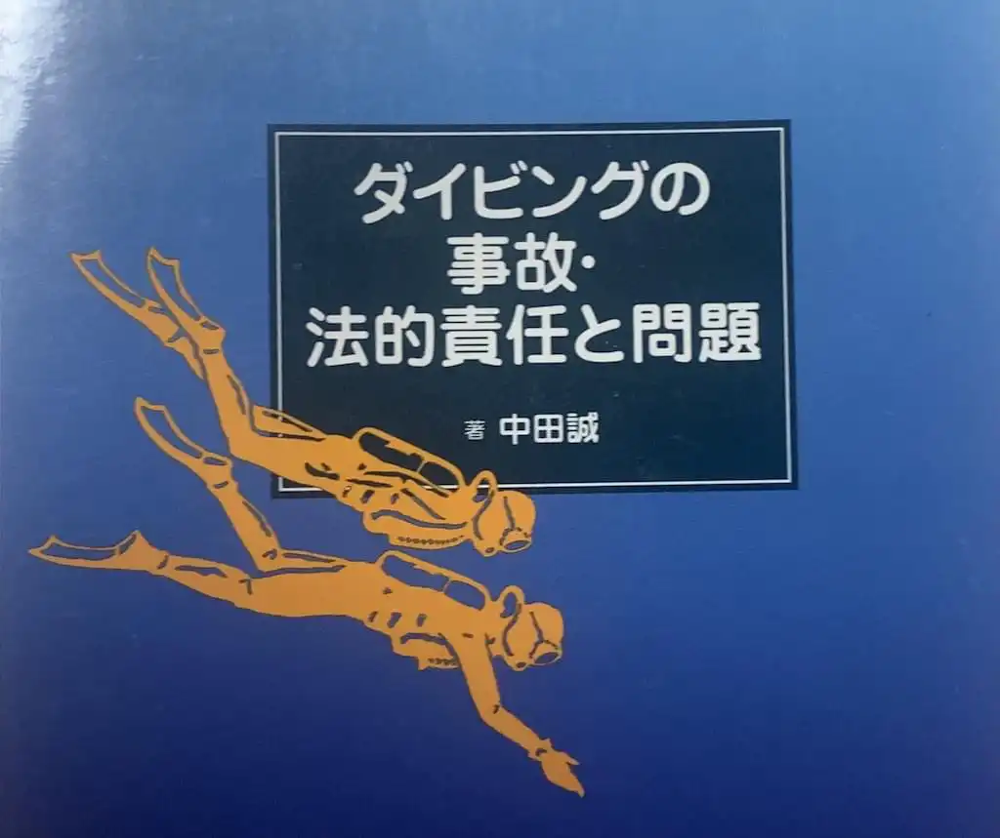

海のない地域で育ったのでずっとダイビングをしたかった。在学中に C カードを取得し、レジャーの消費者として細々と潜ってきた。ダイビングについて自省的でありたいと思って買ったのがこの本。スポーツ法学の専門家である著者が、自らが遭遇したダイビング事故を原体験として怒りと正義感から書き上げた本という印象だ。

ダイビングの事故は基本的に非公開になることが多く、事例集として非常に貴重な一冊。それぞれの事故の背景にあるツアーの設計不良やダイビング業界の構造的問題を取り上げ、事業としてのダイビングに要求される注意義務について一貫した問題提起を行っている。

中立性について疑問を持つような Amazon レビューもあったりするが、ダイビング事故の法的責任という極めて狭い領域ではそのようなバランス感覚などは吹けば飛ぶようなものなのかもしれない。血を流す自己批判は絶対に必要だ。

