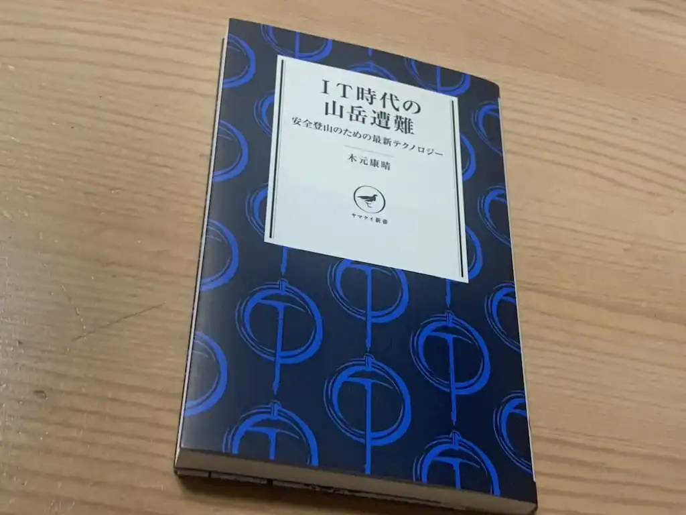

山岳遭難の様相が変わってきていること、それからさまざまなツールの出現を総括する本。SNS の隆盛を背景にしたインターネット上の情報の増加が安易登山者の増加に繋がっているとしている。

要約を見るとテクノロジーの進歩が二律背反の側面のように問題提起されているが、これはややおおげさ。後書きでも、進歩した便利なツールを活用しつつ、インターネット上に氾濫する情報に惑わされないように、とまとめられている。

本書の大部分は現在のメインストリームになっているツール・サービスのリファレンスになっていて、これらを追いかけきれていない登山者におすすめ。

