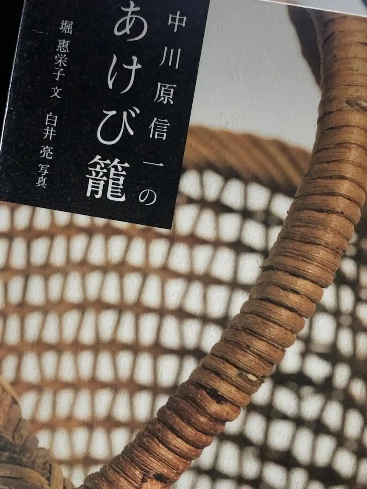

堀 惠栄子 (著), 白井 亮 (写真)、[中川原信一のあけび籠](https://amzn.to/3hwypWl)を読んだ。この本はクラウドファンディングで作られたものらしい。中川原氏のアケビ籠は非常に人気があり、数年待ちの予約になっているとのこと。

使うアケビの蔓はランナーになっているもので、9 月ごろに収穫する。1 年蔓と 2 年蔓（2 年目以降のもの）があり、後者はゴツゴツしているので使えないそうだ。

取手の巻きの部分はアケビのつるを 2 つに裂いて使っているとのこと。フォトブックではあるが、巻末に編み方が乗っているのがよかった。

