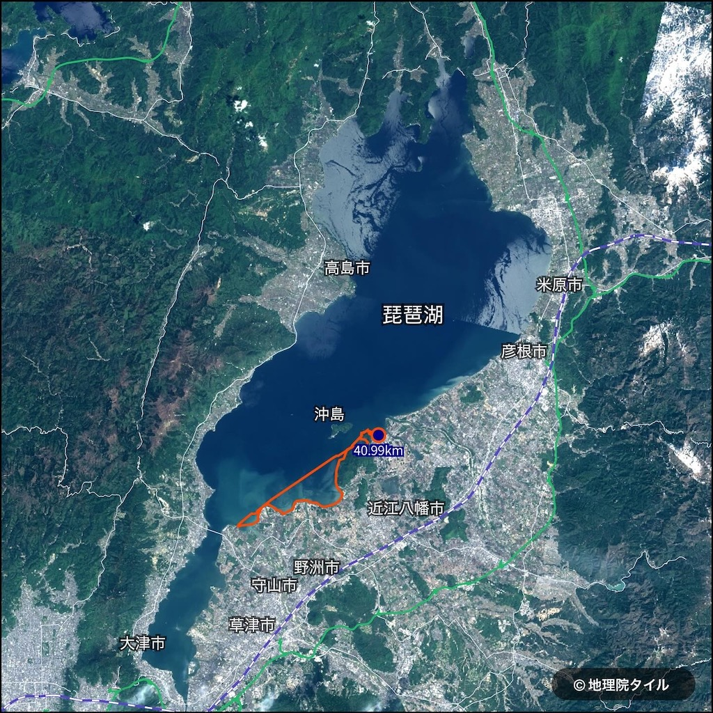
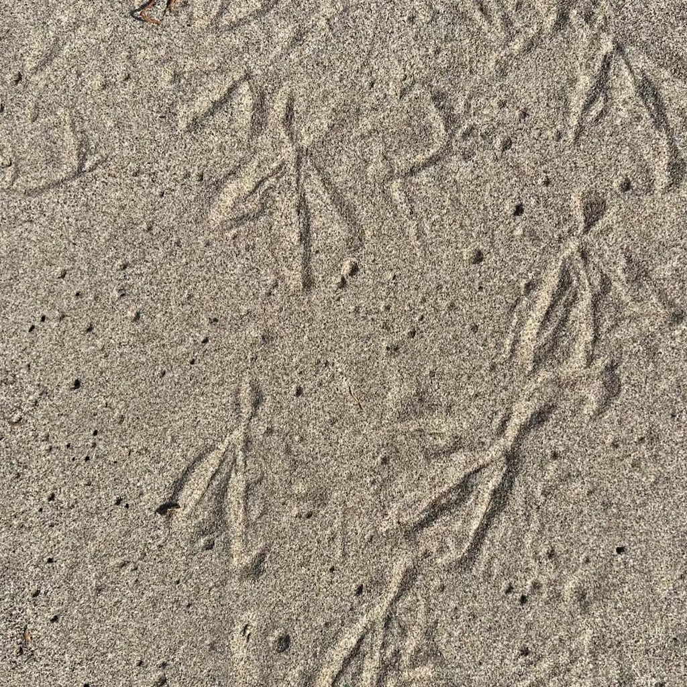
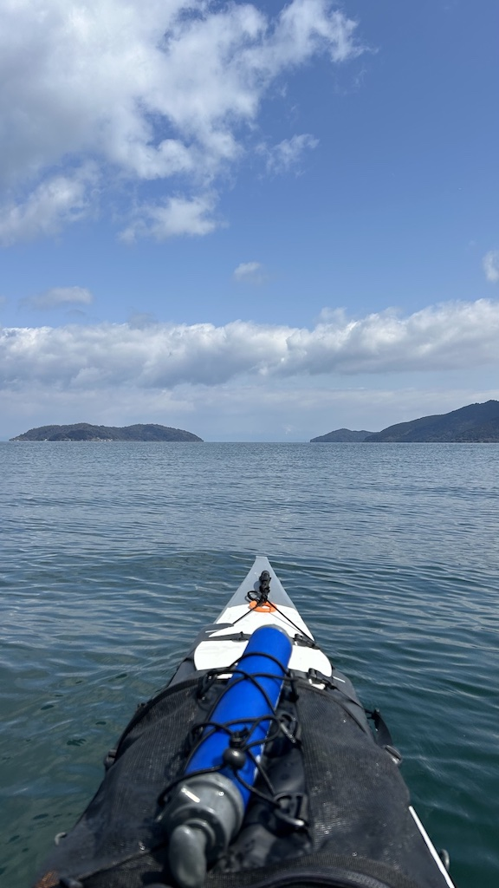
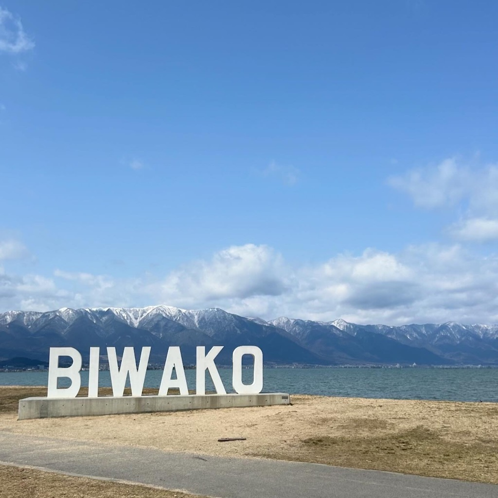
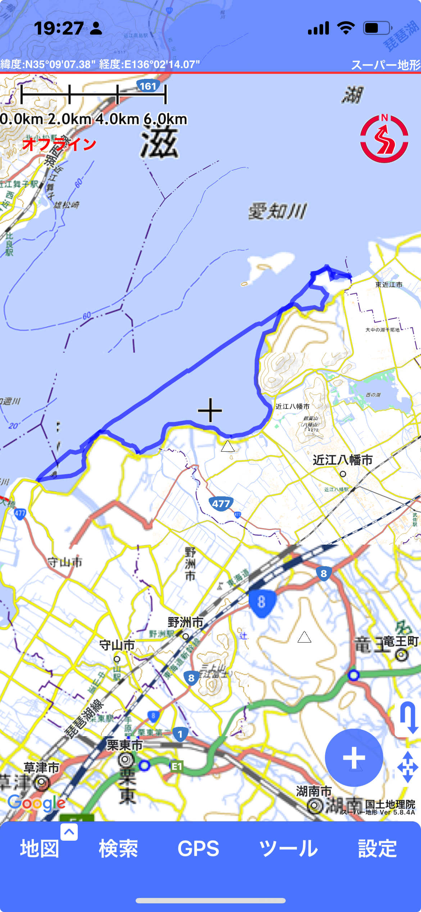

+++
title = '琵琶湖カヤックツーリング。近江八幡から守山まで'
date = 2024-03-22T19:15:42+09:00
categories = ['カヤック']
tags = ['旅行', '琵琶湖', '滋賀県', '近江八幡市', '守山市']
slug = 'kayaking-biwako-okishima-moriyama'
+++

ほぼ全ての湖岸を漕いだ琵琶湖。最後に残った区間を消化しに行ってきました。近江八幡の沖島前から出艇し、琵琶湖なぎさ公園にタッチして戻ってくるピストンコースです。

春分が過ぎたのにも関わらず、強烈な冬型の気圧配置となって冷たい北風が吹いていました。翌日のスキー場はパウダー祭りになるくらい。
カモ類は減り、残ったスズガモは沖合に集結して渡の準備をしています。夏羽になったカンムリカイツブリもちらほらいて春を感じます。

これはカモ類ではなくオオバンの足跡かもしれません。

往路はなぎさ公園まで一直線に漕ぎました。微弱なダウンウィンドで快走でした。

比良山系の稜線に残った雪が美しいです。

今回は Garmin を忘れたため、[スーパー地形](https://apps.apple.com/jp/app/%E3%82%B9%E3%83%BC%E3%83%91%E3%83%BC%E5%9C%B0%E5%BD%A2/id1092797286)でトラックを記録してみました。電池の持ちも十分で、機内モードで運用すれば数日分は記録できそうです。

復路は岸沿いコースを取ったのでだいぶ距離が伸びました。当初は 30km 強の予定が 40km オーバーに。撤収時の北風が冷たくて凍えてしまいました。

---

久々の 40km/日 オーバーで、今年控えているいくつかの遠征プランの良いトレーニングになりました。
