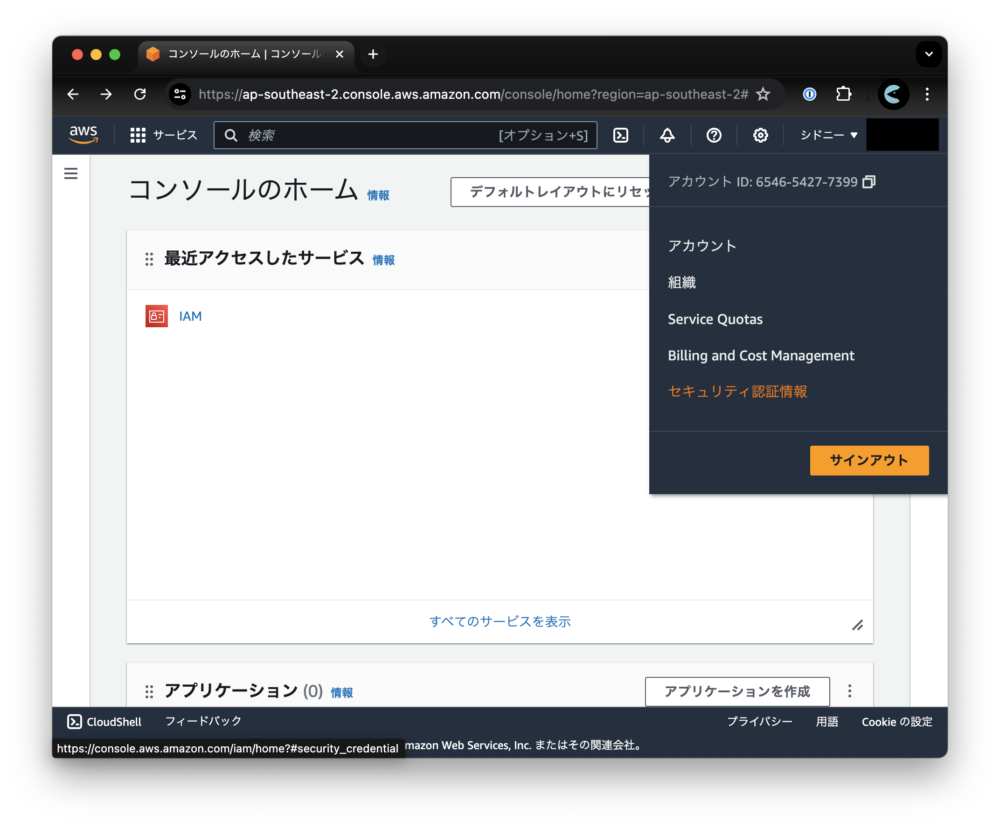
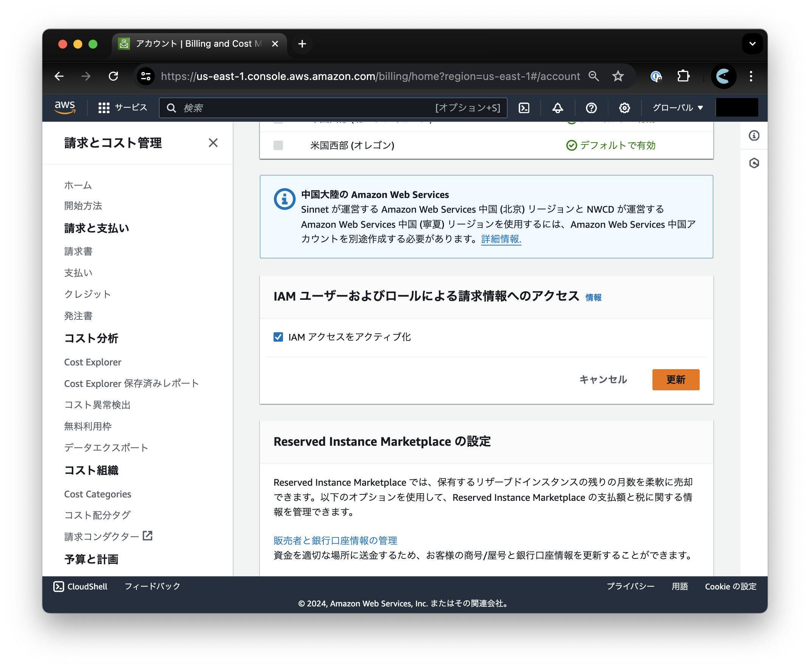

+++
title = 'IAM ユーザーに AWS の請求情報へのアクセスを許可する方法'
date = 2024-06-24T09:24:37+09:00
slug = 'enable-aws-iam-user-to-show-billing'
categories = ['コーディング']
tags = ['AWS']
+++

新規案件において久しぶりに AWS 組織を作成し、クライアントにお渡ししようとしたところ、作成した IAM ユーザーが AWS の請求情報にアクセスできませんでした。

以下の設定を忘れていたため、スクリーンショットと共にメモしておきます。

---
ルートアカウントでログインし、右上のグローバルメニューからアカウントを選択すると設定項目があるページに移動できます。以下の URL からもアクセス可能です。  
https://us-east-1.console.aws.amazon.com/billing/home#/account

この中に、「IAM ユーザーおよびロールによる請求情報へのアクセス」というセクションがあるのでこれをオンにします。

以上で完了です！

